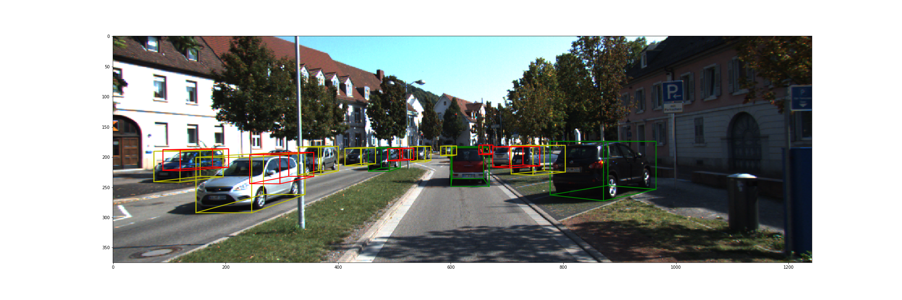

## KITTI 3D Object Detection Python

-----------------
I've ported the KITTI Devleopment Kit to Python. For 3D boudning Boxes Visualization.

Please see the Notebook for instructions on how to use.
